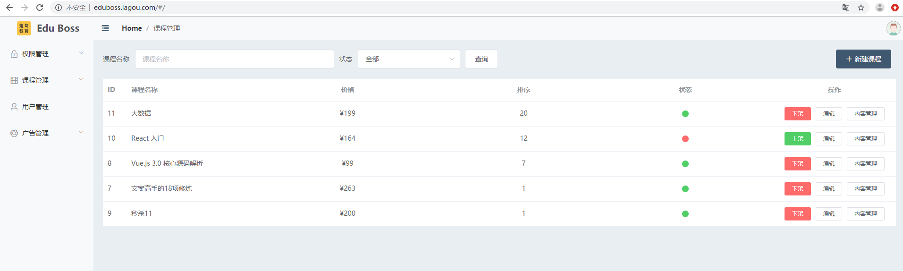
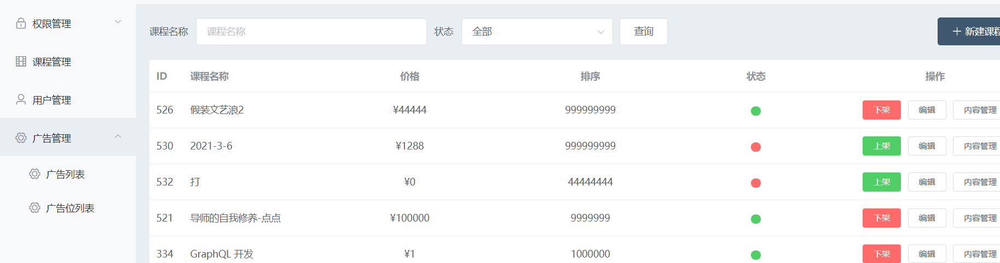
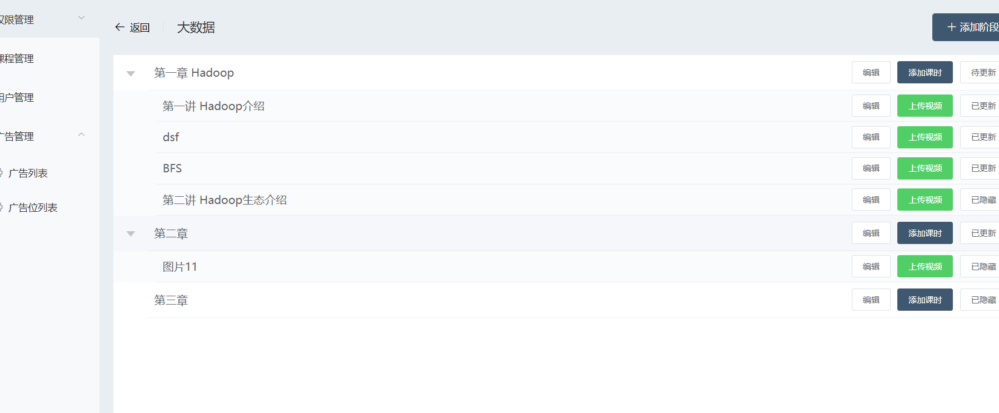
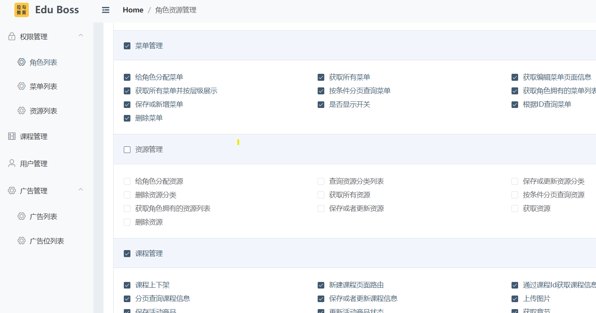

# SSM_Project
Include Spring( for Service) SpringMVC,(for Controller) Mybatis( for Persistence)

这个项目是2020年12月做的一个SSM框架项目。

SSM即： Spring + Spring MVC + MyBatis 。

项目分层进行实现。用户在前端页面发送请求到控制器层(Spring MVC), 控制器层调用业务逻辑层(Spring)，之后业务层向持久层(MyBatis)发送请求，持久层内部又封装了JDBC的操作，来与数据库来进行交互。

之后将结果返回到业务层(Service)，业务层处理逻辑，发送给控制器层，控制器层再调用视图，用数据展现到前端页面。

---

**项目描述**

教育后台管理系统，是提供给内部人员使用的一个后台管理系统。业务人员可以在这个后台管理系统中，对课程信息，广告信息，用户信息，权限信息等数据进行维护。

**项目开发环境**

*  开发工具
  * 后端： Intellj Idea 2016
  * 前端 VsCode
  * 数据库 可视化工具： SqlYogs
* 开发环境
  * JDK11
  * Maven 3.6.3
  * Mysql 5.7

**项目技术选型**

* 后端
  * WEB 层： 使用springmvc接收请求，进行视图跳转
  * Service层：使用spring进行IOC、AOP、及事务管理
  * DAO层： 借助mybatis进行数据库交互
* 前端
  * Vue.js    一套用于构建用户界面的渐进式JavaScript框架
  *  Element UI 库    element-ui 是饿了么前端出品的基于 Vue.js的 后台组件库， 方便程序员进行页面快速布局和构建 
  * node.js 简单的说 Node.js 就是运行在服务端的 JavaScript 运行环境 .
  * axios 对ajax的封装, 简单来说就是ajax技术实现了局部数据的刷新，axios实现了对 ajax的封装，

---

**各个模块的作用**

| ssm_utils       | 工具包(如MD5加密)                       |
| :-------------- | --------------------------------------- |
| **ssm_domain**  | **基本的实体类：Pojo**                  |
| **ssm_dao**     | **数据交互层 使用MyBatis 与数据库交互** |
| **ssm_service** | **业务逻辑层，使用Spring来进行封装**    |
| **ssm_web**     | **控制器层 使用Spring MVC 来封装 **     |

ps：为角色分配菜单，点击分配菜单，回显可选择菜单信息，并回显选中状态。

* 首先查询所有的菜单列表
* 根据角色ID查询关联菜单ID
* 为角色分配菜单列表
  * 删除老的role_menu 表
  * 新增新的role_menu表

---

**效果展示**

查询到所有课程的信息

课程内容，章节，课时的展示与修改

分配资源（分配菜单）

